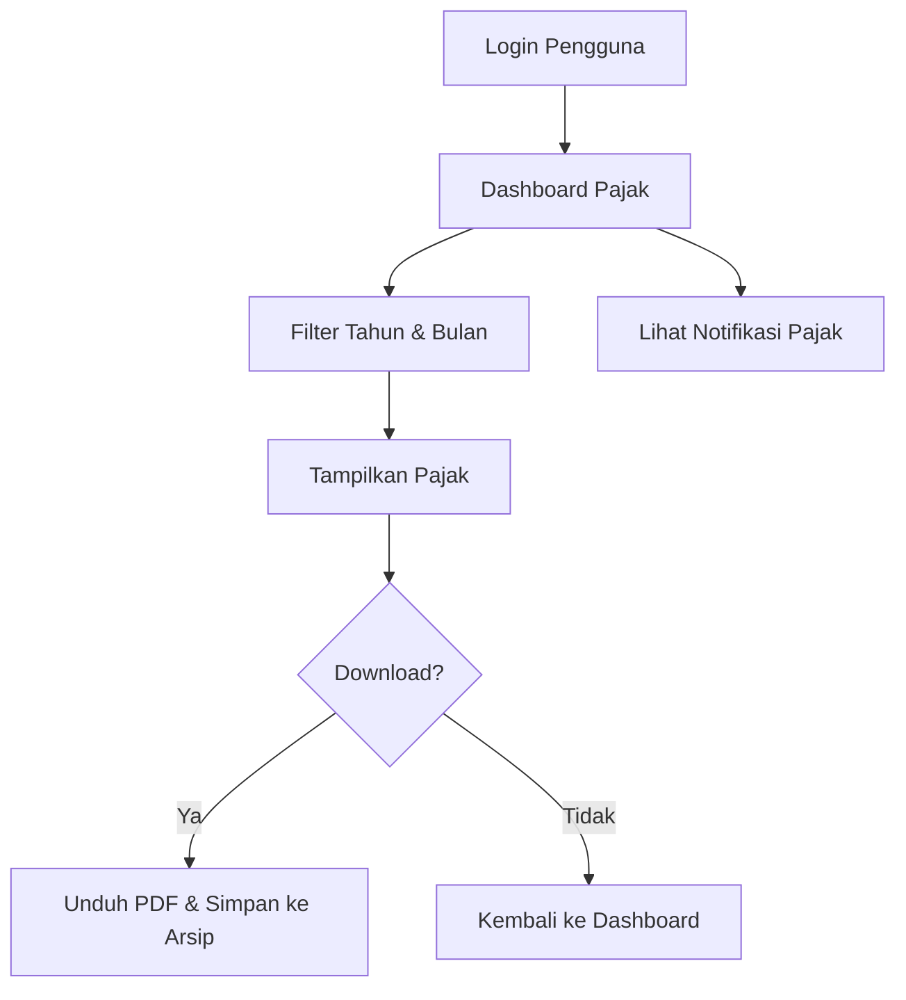

# 📘 Sistem Informasi Perhitungan Pajak Pegawai Kabupaten Pringsewu

Aplikasi ini dikembangkan menggunakan framework **CodeIgniter 4**, bertujuan untuk menghitung, mengelola, dan menyimpan pajak penghasilan PPh 21 bagi pegawai ASN.

---

## 👨‍💼 Bagian 1: Modul Admin (Pengelola Sistem)

### 🔐 1. Modul Autentikasi Admin

- **Fungsi**: Melindungi sistem agar hanya admin yang bisa mengelola data pegawai dan pajak.
- **Controller**: `Auth.php`
- **View**: `login.php`
- **Logika**: Autentikasi dilakukan via session. Jika berhasil login, diarahkan ke dashboard admin.

---

### 👥 2. Modul Data Pegawai

- **Fungsi**: Menyimpan data pokok pegawai.
- **Controller**: `Pegawai.php`
- **Model**: `PegawaiModel.php`
- **View**:
  - `pegawai/index.php`
  - `pegawai/create.php`
  - `pegawai/edit.php`
- **Data yang dikelola**:
  - NIP, Nama, Golongan
  - Status PTKP (TK/0, K/1, K/2, dst)
- **Fitur**:
  - CRUD data pegawai
  - Validasi input dan pencarian

---

### 💰 3. Modul Komponen Gaji & Pajak

- **Controller**: `Pajak.php`
- **Model**: `PajakModel.php`
- **View**:
  - `pajak/form_hitung.php`
  - `pajak/detail.php`
- **Komponen yang dihitung**:
  - Gaji Pokok, Tunjangan, Pembulatan
  - TPP, THR, Gaji 13, Iuran Pensiun

#### 💡 Alur Perhitungan:

1. Hitung Gaji Bruto  
2. Tentukan Golongan TER (A/B/C)  
3. Ambil tarif TER berdasarkan status  
4. Pajak Bulanan = Bruto × TER%  
5. Pajak Tahunan = Pajak Bulanan × 12

```php
$bruto = $gaji_pokok + $tunj_jabatan + $tunj_lainnya;
$golongan = getGolonganTER($status, $bruto);
$tarif_TER = getTER($golongan, $status);
$pajak_bulanan = $bruto * $tarif_TER / 100;
$pajak_tahunan = $pajak_bulanan * 12;
```

---

### 📄 4. Modul Laporan & Export

- **View**:
  - `laporan/laporan_pdf.php`
  - `laporan/laporan_excel.php`
- **Helper**: `pdf_helper.php` (menggunakan Dompdf)
- **Fitur**:
  - Export laporan per pegawai
  - Export laporan semua pegawai (bulanan/tahunan)
  - Format PDF & Excel

---

### 🗃️ 5. Struktur Database Inti

| Tabel     | Deskripsi                           |
|----------|-------------------------------------|
| `pegawai` | Data pegawai dan status PTKP        |
| `pajak`   | Data komponen pajak                 |
| `arsip`   | Menyimpan riwayat laporan unduhan   |
| `users`   | Menyimpan akun login pengguna biasa |

---

## 👤 Bagian 2: Modul Pengguna (Pegawai Biasa)

### ✅ Alur Autentikasi Pengguna

1. **Registrasi Akun**
   - Hanya pegawai yang terdaftar di database (`pegawai`) yang bisa mendaftar
   - Input: NIP, Nama, Password
   - Sistem akan validasi NIP terlebih dahulu

2. **Login**
   - Login menggunakan NIP dan password
   - Jika berhasil, diarahkan ke dashboard pengguna

3. **Keamanan**
   - Validasi terhadap NIP
   - Session hanya memungkinkan akses data milik sendiri

---

### 🔐 Fitur Login & Registrasi

| Fitur              | Penjelasan                                  |
|--------------------|---------------------------------------------|
| `login.php`        | Form login pengguna                         |
| `register.php`     | Form daftar akun baru (validasi NIP)        |
| Session Management | Menggunakan session dari CodeIgniter        |

---

### 🧩 Fitur Utama Modul Pengguna

| Fitur                  | File View                 |
|------------------------|---------------------------|
| Dashboard Pajak        | `dashboard.php`           |
| Filter Arsip Bulanan   | `arsip.php`               |
| Filter Arsip Tahunan   | `arsip_tahunan.php`       |
| Notifikasi Pajak Masuk | `notifikasi.php`          |
| Export PDF Bulanan     | `pdf_laporan.php`         |
| Export PDF Tahunan     | `pdf_laporan_tahunan.php` |
| Edit Profil            | `edit_profil.php`         |
| Ganti Password         | `edit_password.php`       |

---

### 🔄 Alur Interaksi Pengguna



---

### 🧠 Contoh Validasi Pendaftaran

```php
$pegawai = $this->PegawaiModel->where('nip', $inputNip)->first();
if ($pegawai) {
    // lanjut daftar
} else {
    // tampilkan error: "NIP tidak ditemukan"
}
```

---

### ✅ Kelebihan Modul Pengguna

| Fitur                   | Penjelasan                                |
|------------------------|-------------------------------------------|
| 🔒 Autentikasi Personal | Akses aman, hanya untuk pegawai terdaftar |
| 📂 Arsip Pajak Pribadi  | Menyimpan riwayat laporan unduhan         |
| 📆 Filter Pajak         | Berdasarkan bulan & tahun                 |
| 📤 Export Mandiri       | Download PDF Bulanan & Tahunan            |
| 🔁 Ganti Password       | Keamanan akun pengguna                    |

---

## 🧪 Unit Testing

- Folder `tests/unit/` digunakan untuk:
  - Uji fungsi perhitungan pajak
  - Validasi form pegawai
  - Validasi PDF dan export laporan

---

## 🧰 Fitur Tambahan

- Upload dokumen pendukung (`/public/uploads/`)
- Validasi otomatis menggunakan `form_validation` CI4
- Tampilan UI responsif menggunakan Bootstrap 5

---

## 💡 Pengembangan Selanjutnya (Saran)

- Modul Presensi Berbasis Lokasi
- Penambahan role bendahara/verifikator
- Mobile App (Flutter / Android Studio)
- Integrasi e-Sign / QR Code pada PDF
- Sistem Arsip Otomatis ke Google Drive atau Cloud

---

## 🔧 Teknologi yang Digunakan

- PHP 5.2.2
- CodeIgniter 4
- MySQL / MariaDB
- Bootstrap 5
- Dompdf (Export PDF)

---

## 👨‍💻 Developer

Dikembangkan untuk kebutuhan instansi pemerintahan, khususnya di lingkungan Kabupaten Pringsewu.
EOF
